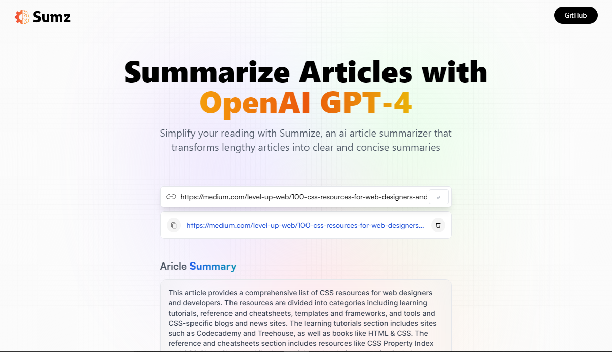

<a name="readme-top"></a>

# Summize: An AI Article Summarizer
It is a web application that uses GPT-4 AI to summarize articles. It summarizes articles in just a few seconds and provides the user with a concise summary of the article. It also saves articles summary and respective urls to localStorage for later access and also has delete summary functionality.

### [Save Time by Getting Summary of an Article using AI...](https://summaize.netlify.app/)

## Preview


<!-- GETTING STARTED -->
## Getting Started

Instructions on setting up and running this project locally.

### Prerequisites

To get started with this application, you need to have Node.js and npm installed on your computer.
* Download and install node.js from [here...](https://nodejs.org/en)

### Installation

_Below is an example of how you can instruct your audience on installing and setting up your app. This template doesn't rely on any external dependencies or services._

1. Get a free API Key at [RapidApi - Article Extractor and Summarizer](https://rapidapi.com/restyler/api/article-extractor-and-summarizer/)
2. Clone the repo
   ```sh
   git clone https://github.com/SomveerKr/summize-ai-article-summarizer.git
   ```
3. Install all NPM packages or dependencies
   ```sh
   npm install
   ```
4. Enter your API KEY in `.env.example` and rename it to `.env`
   ```js
   VITE_RAPID_API_ARTICLE_KEY=yourRapidApiKeyHere
   ```
5. Run Application Locally
```sh
npm run dev
```

## Built With
1. Rapid API - for the [AI summarization API](https://rapidapi.com/restyler/api/article-extractor-and-summarizer/).
2. Tailwind - for the CSS styling.
3. React - for building the user interface.
4. React-Redux Toolkit - for state management.


## Usage
1. Enter the URL of the article you want to summarize.
2. Wait for a few seconds while the AI summarizes the article.
3. Read the summary.

## Contributing
If you want to contribute to this project, you can fork the repository, make changes, and create a pull request.

## License
This project is licensed under the MIT License.

<p align="right">(<a href="#readme-top">back to top</a>)</p>

